# Stack Overview

One architecture. Every Meterless product runs the same flow.



```text
User / Event
   ↓
Scout Intent            what does the user want? which agent or workflow activates?
   ↓
H-MEM + World Model     what do we durably know? what is the current state?
   ↓
Markovian or Swarm      compressed reasoning, or divergent multi-agent generation
   ↓
Runtime Quality Layer   quality, cost, and latency routing
   ↓
Relay / Gaia / Swarms   execution, interface, and output surfaces
   ↓
Verified Output + Updated Memory
```

## Layer by layer

| Layer | Engine | Status |
|---|---|---|
| Intent detection and routing | [Scout Intent](../../engines/scout-intent/) | Spec available |
| Durable memory | [H-MEM](../../engines/hmem/) | Spec available |
| State modeling | [World Model](../../engines/world-model/) | Spec available |
| Reasoning compression | [Markovian](../../engines/markovian/) | Spec available |
| Multi-agent coordination | Swarm orchestration | Future engine drop, see [roadmap](../../ROADMAP.md) |
| Quality, cost, latency routing | Runtime | Future engine drop, see [roadmap](../../ROADMAP.md) |

## Product surfaces

| Surface | Role | Docs |
|---|---|---|
| Gaia | Personal agent workspace | [docs/products/gaia/](../products/gaia/README.md) |
| Relay | Agent execution layer | [docs/products/relay/](../products/relay/README.md) |
| Swarms | Divergent generation layer | [docs/products/swarms/](../products/swarms/README.md) |

The engines compose. H-MEM feeds chunk zero of a Markovian run and mines the output back into memory. The World Model replicates facts into H-MEM and answers scoped queries planned upstream. Each engine's examples folder shows these pairings from its own side.
