# H-MEM

Hierarchical memory and durable context. A knowledge graph that mines, retrieves, dreams, and audits.



Status: spec available. The engine is an AGENTS.md-driven implementation spec, not a runtime library.

## Focused clone

```bash
npx degit meterless/meterless/engines/hmem my-hmem
```

Then open the folder in your coding agent and follow its AGENTS.md.

## Links

- Spec folder: [`engines/hmem/`](../../engines/hmem/)
- Deep-dive docs: [`engines/hmem/docs/`](../../engines/hmem/docs/)
- README: [`engines/hmem/README.md`](../../engines/hmem/README.md)
