# Scout Intent

Intent detection, risk guarding, tool routing, and signed execution contracts. Scout runs before every meaningful action; downstream engines act only on its contracts.



Status: spec available. The engine is an AGENTS.md-driven implementation spec with a REAL runnable eval harness: a locked 32-example regression set, seven gated metrics with per-slice floors, and a runner that scores any implementation via `SCOUT_IMPL`.

## Focused clone

```bash
npx degit meterless/meterless/engines/scout-intent my-scout-intent
```

Then open the folder in your coding agent and follow its AGENTS.md.

## Links

- Spec folder: [`engines/scout-intent/`](../../engines/scout-intent/)
- Deep-dive docs: [`engines/scout-intent/docs/`](../../engines/scout-intent/docs/)
- Eval harness: [`engines/scout-intent/evals/`](../../engines/scout-intent/evals/)
- README: [`engines/scout-intent/README.md`](../../engines/scout-intent/README.md)
