# Meterless Products

**Three products. One architecture. Pick your surface.**

Every Meterless product is a different surface over the same open engines: [H-MEM](../../engines/hmem/), [World Model](../../engines/world-model/), [Markovian](../../engines/markovian/), and [Scout Intent](../../engines/scout-intent/). The full breakdown for each product lives on its own page. Choose the one you want below. The live demos are the same scenes that run in the hero at [meterless.ai](https://www.meterless.ai).

<table>
  <tr>
    <td width="33%" align="center">
      
      <b>Gaia</b> 
      The personal agent workspace  
      <a href="gaia/README.md"><b>Choose Gaia →</b></a>
    </td>
    <td width="33%" align="center">
      
      <b>Relay</b> 
      The agent execution layer  
      <a href="relay/README.md"><b>Choose Relay →</b></a>
    </td>
    <td width="33%" align="center">
      
      <b>Swarms</b> 
      The divergent generation layer  
      <a href="swarms/README.md"><b>Choose Swarms →</b></a>
    </td>
  </tr>
</table>

## How to choose

| You want… | Choose |
|---|---|
| An AI workspace that remembers your projects, context, and decisions across sessions, devices, and models | [Gaia](gaia/README.md) |
| Agents that operate your real desktop (windows, files, apps, browsers) with vision verification and approval gates | [Relay](relay/README.md) |
| One prompt turned into a coordinated agent team that produces, ranks, and refines many distinct variants | [Swarms](swarms/README.md) |

All three compound: Relay turns successful work into reusable missions, Gaia carries the context forward, Swarms explores the option space. Read the [architecture overview](../architecture/stack-overview.md) for how the surfaces share one stack.

---

## Gaia · the personal agent workspace

Gaia is the local-first AI interface that remembers your context, understands your work, and coordinates agentic workflows. A cognitive kernel of 12 specialist brains (execution, perception, intelligence, autonomy) writes into one shared context that stays yours, independent of whichever model created it.

Runs on [H-MEM](../../engines/hmem/), [World Model](../../engines/world-model/), and [Markovian](../../engines/markovian/).

**[Choose Gaia →](gaia/README.md)** · [Getting started](gaia/getting-started.md) · [Features](gaia/features.md) · [FAQ](gaia/faq.md)

---

## Relay · the agent execution layer

Relay gives AI agents a local body: describe the job, select the windows Relay can access, inspect the plan, and save successful work as a reusable mission. Every step is vision-verified, and risky steps halt at an approval gate until you say go.

Runs on [World Model](../../engines/world-model/), [Markovian](../../engines/markovian/), and [Scout Intent](../../engines/scout-intent/).

**[Choose Relay →](relay/README.md)** · [Getting started](relay/getting-started.md) · [Features](relay/features.md) · [FAQ](relay/faq.md)

---

## Swarms · the divergent generation layer

Swarms breaks AI sameness. Type one goal and it auto-generates the agent team, forks your prompt into parallel variants that stream in as they finish, then ranks, reconciles, and refines them into a result better than any single pass.

Runs on swarm orchestration (flagship engine drop coming), [Scout Intent](../../engines/scout-intent/), and [Markovian](../../engines/markovian/).

**[Choose Swarms →](swarms/README.md)** · [Getting started](swarms/getting-started.md) · [Features](swarms/features.md) · [FAQ](swarms/faq.md)

---

The application binaries are proprietary; this documentation, like everything in the flagship repo, is Apache 2.0. Desktop installers ship from each product's Releases page, and Swarms also runs on the web at [meterless.ai](https://www.meterless.ai).
