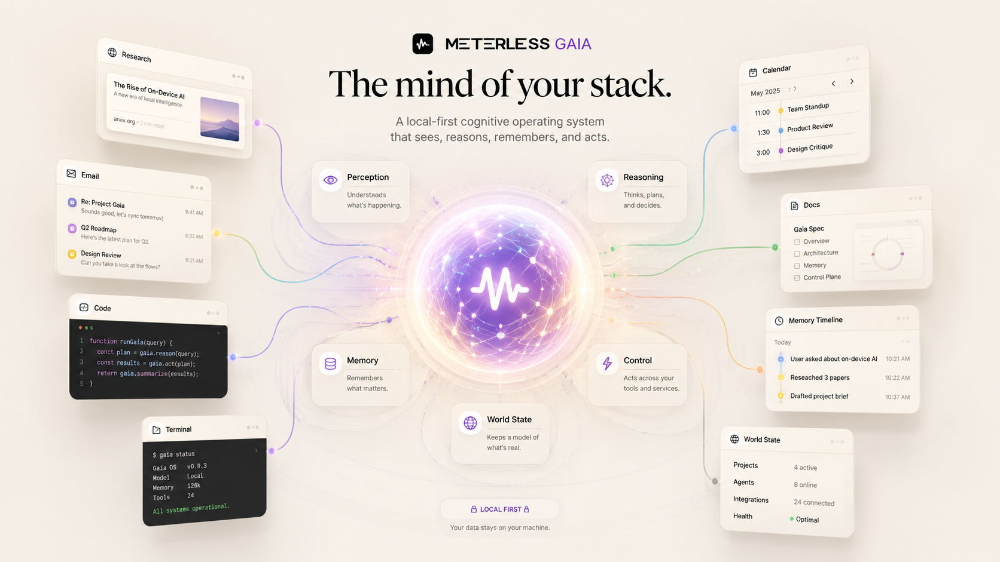

# Gaia

**The personal agent workspace.**

Gaia is the local-first AI interface that remembers your context, understands your work, and coordinates agentic workflows. It is one of three product surfaces built on the shared Meterless engines. It is not a standalone experiment. It is the interface layer of one architecture.

## Install

Download the latest installer from [Releases](https://github.com/meterless/gaia/releases/latest). The application binary is proprietary. This documentation is MIT, like everything in the flagship repo.

## Engines inside

| Engine | What it does in Gaia |
|---|---|
| [H-MEM](../../../engines/hmem/) | Three-layer hierarchical memory. Gaia remembers across sessions without you managing it. |
| [World Model](../../../engines/world-model/) | Tracks your projects, tasks, and environment state. |
| [Markovian](../../../engines/markovian/) | Long-horizon chunked reasoning that carries compressed state forward instead of growing the prompt. |
| Swarm orchestration | Bounded task decomposition for Gaia's swarm mode. Ships later as a flagship engine drop. |

## Docs

- [Getting started](getting-started.md)
- [Features](features.md)
- [Mentions](mentions.md)
- [Shortcuts](shortcuts.md)
- [Privacy](privacy.md)
- [FAQ](faq.md)
- [Troubleshooting](troubleshooting.md)

## The stack

Gaia is one of three Meterless product surfaces. [Relay](../relay/README.md) is the agent execution layer. [Swarms](../swarms/README.md) is the divergent generation layer. All three run on the same engines. Read the [architecture](../../architecture/stack-overview.md).
