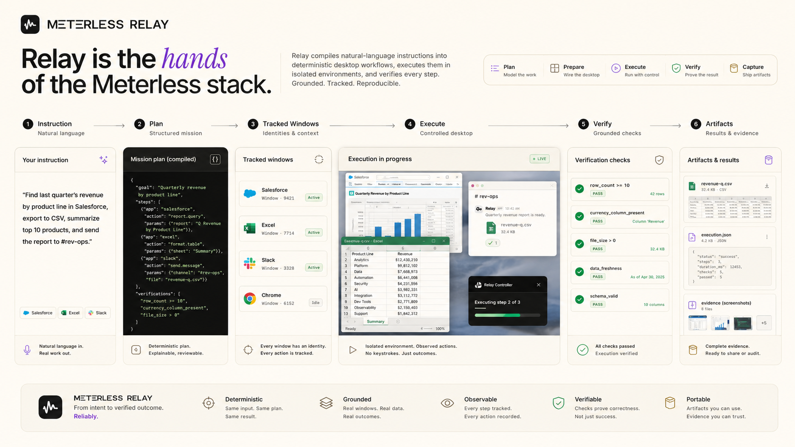

# Relay

**The agent execution layer.**

Relay gives AI agents a local body: the ability to operate desktop workflows, files, apps, browsers, and business processes with verification. It is one of three product surfaces built on the shared Meterless engines.

## Install

Download the latest installer from [Releases](https://github.com/meterless/relay/releases/latest). The application binary is proprietary. This documentation is Apache 2.0, like everything in the flagship repo.

## Engines inside

| Engine | What it does in Relay |
|---|---|
| [World Model](../../../engines/world-model/) | Models the desktop environment and workflow state before and after each action. |
| [Markovian](../../../engines/markovian/) | Next-action logic and compressed state across long workflow runs. |
| [Scout Intent](../../../engines/scout-intent/) | Turns natural-language instructions into routed, verified execution plans. |

Relay adds verification and human approval loops on top: actions are checked against expected outcomes before a workflow continues.

## Docs

- [Getting started](getting-started.md)
- [Features](features.md)
- [Shortcuts](shortcuts.md)
- [Privacy](privacy.md)
- [FAQ](faq.md)
- [Troubleshooting](troubleshooting.md)

## The stack

Relay is one of three Meterless product surfaces. [Gaia](../gaia/README.md) is the personal agent workspace. [Swarms](../swarms/README.md) is the divergent generation layer. All three run on the same engines. Read the [architecture](../../architecture/stack-overview.md).
