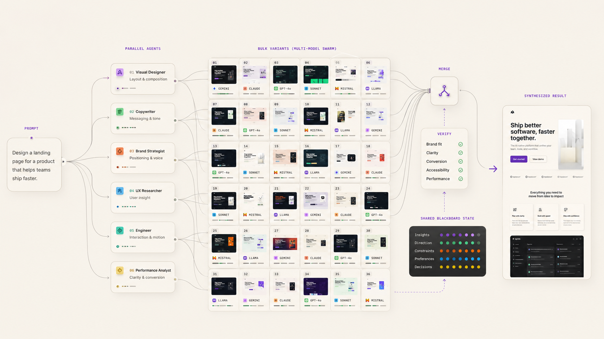

# Swarms

**The divergent generation layer.**

Swarms breaks AI sameness. It turns one prompt into a coordinated team of agents that plan, parallelize, produce many high-quality variants, then rank, reconcile, and refine them. It is one of three product surfaces built on the shared Meterless engines.

## Install

Download the latest desktop installer from [Releases](https://github.com/meterless/swarms/releases/latest), or use the web version via [meterless.ai](https://www.meterless.ai). The application binary is proprietary. This documentation is Apache 2.0, like everything in the flagship repo.

## Engines inside

| Engine | What it does in Swarms |
|---|---|
| Swarm orchestration | DAG planning, dynamic specialists, merge and verify. Ships later as a flagship engine drop. |
| [Scout Intent](../../../engines/scout-intent/) | The intent taxonomy that classifies what kind of work a prompt is. |
| [Markovian](../../../engines/markovian/) | Reasoning compression across multi-pass refinement. |

Swarms adds verbalized sampling, ranking, reconciliation, and multi-pass refinement on top of the orchestration engine.

## Docs

- [Getting started](getting-started.md)
- [Features](features.md)
- [Shortcuts](shortcuts.md)
- [Privacy](privacy.md)
- [FAQ](faq.md)
- [Troubleshooting](troubleshooting.md)

## The stack

Swarms is one of three Meterless product surfaces. [Gaia](../gaia/README.md) is the personal agent workspace. [Relay](../relay/README.md) is the agent execution layer. All three run on the same engines. Read the [architecture](../../architecture/stack-overview.md).
