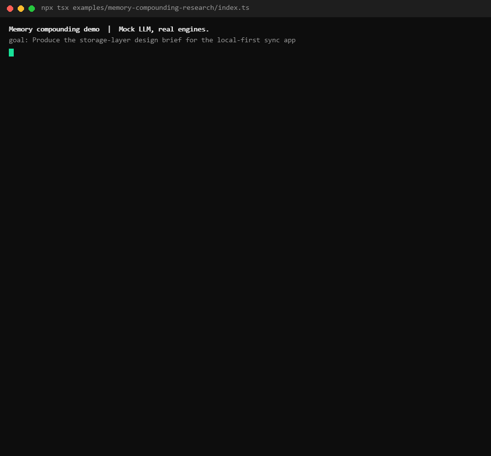
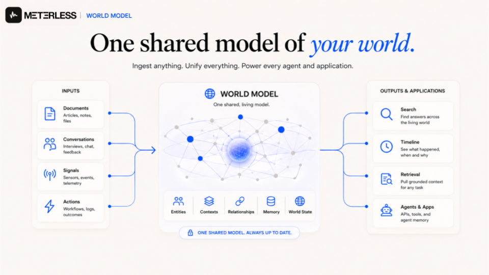
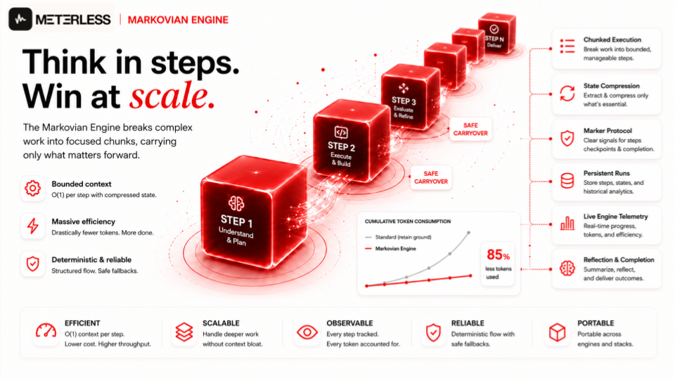
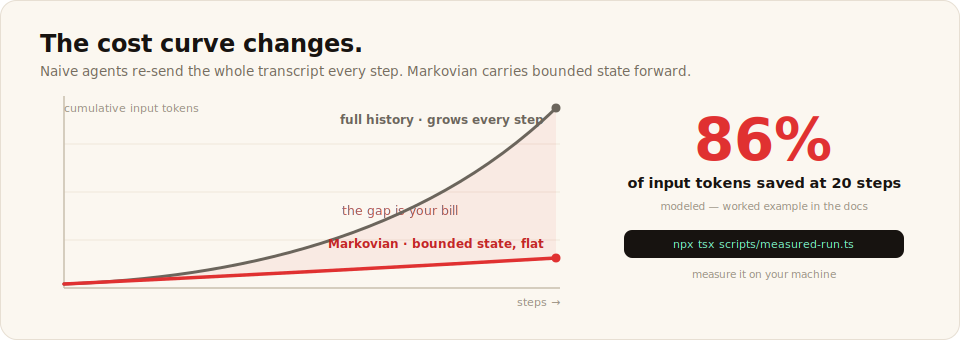
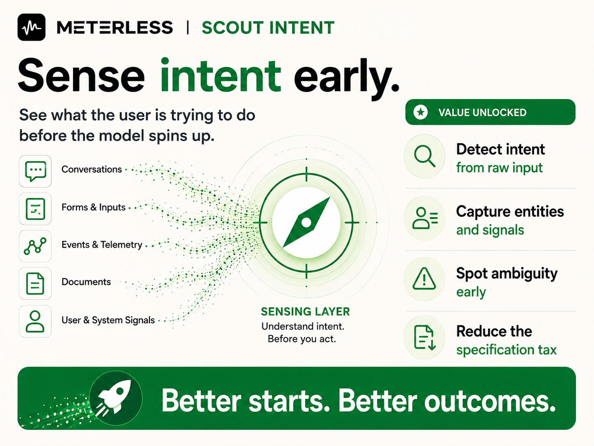

# The Meterless Engines

[](#pick-your-engine)
[](#built-to-be-built-by-agents)
[](../AGENTS.md)
[](../LICENSE)

**Agents fail on thin context, not weak models.** These four engines are the context layer: durable memory, grounded state, flat-cost reasoning, and intent-aware routing — local-first, provider-agnostic, and yours forever.



An engine here is **not an npm package**. It is an implementation spec built for coding agents: a full `AGENTS.md` contract, runnable examples, workshops, and a conformance suite that proves your build is correct. Clone a folder, hand it to your agent, gate on the suite:

```bash
npx degit meterless/meterless/engines/hmem my-hmem
# then: "Implement the H-MEM engine in this project following AGENTS.md."
```

---

## Pick your engine

| Your agent… | You need | Status | Proof |
|---|---|---|---|
| Forgets what users told it last week, and can't explain what it *does* recall | [**H-MEM**](#h-mem) | Spec + runnable reference | [conformance](hmem/conformance/) |
| Hallucinates entities, or you're rebuilding domain state for every app | [**World Model**](#world-model) | Spec + runnable reference | [conformance](world-model/conformance/) |
| Burns tokens quadratically the longer a run goes | [**Markovian**](#markovian) | Spec + runnable reference | [conformance](markovian/conformance/) |
| Executes before it understands — and your routing layer is the buggiest code you own | [**Scout Intent**](#scout-intent) | Spec | [eval harness](scout-intent/evals/) |

Each folder is fully self-contained, with its own `AGENTS.md`, docs, examples, and workshops. Take one engine or take the stack.

---

## H-MEM

**Memory that remembers, learns, and evolves. Private. Local-first. Auditable.**


Every agent that ships to real users hits the same three walls — **stale facts**, **black-box recall**, and **memory rot** — and none of them is fixed by a better embedding model. H-MEM is a hierarchical human-memory architecture: short-term, working, and long-term tiers with mining, retrieval, dreaming, sleep, trust, and conflict resolution.


What a vector store can't do, H-MEM specifies:

- **8-signal hybrid ranking** — recall is scored, not similarity-only
- **Provenance on every record** — source, confidence, lineage
- **A real lifecycle** — capture → enrich → retrieve → dream → sleep
- **Human-approved synthesis** — dreaming proposes, you approve, `derivedFrom` links it
- **Preview-first maintenance** — sleep consolidates with backup/restore, never silently
- **Append-only trust ledger** — every mutation audited
- **Contradictions detected** — scored and resolved on the record, not last-write-wins

The proof point: *"Why did the agent say March 14?"* is answered by a five-line ledger trace — mined from a user correction, conflicted with the stale value, resolved by a named human, retrieved at a known score. Nothing hidden, nothing unattributed.

**And memory compounds.** The same 12-step task, cold vs warm — the warm run starts with H-MEM memory and finishes in 8 chunks instead of 12. Runs on your machine in 90 seconds, no API keys:



```bash
npx degit meterless/meterless/engines/hmem my-hmem
cd my-hmem/reference && npm install && npm test     # working reference, green in about a minute
npx tsx ../examples/01-add-memory/index.ts          # watch a memory get mined, stored, audited
```

[Spec](hmem/AGENTS.md) · [Architecture](hmem/docs/architecture.md) · [Examples](hmem/examples/) · [Workshops](hmem/workshops/) · [Demos](hmem/demos/) · [Conformance](hmem/conformance/) · [Overview page](../docs/engines/hmem.md)

---

## World Model

**One shared model of your world. Ingest anything. Unify everything.**



Every AI product eventually needs a persistent picture of its domain. Most teams build it three times — as JSON blobs, then a Postgres schema, then a knowledge graph nobody can edit or audit. World Model is the version you build **once**: a persistent, queryable, evolving graph of entities, contexts, and relationships.



- **Canonical store** — an append-only event log is the single source of truth
- **Derived views** — graph, timeline, search, custom projections; all rebuildable from the log
- **Idempotent ingest** — same input, same event log; replay is always safe
- **Stable IDs** — content-addressable, alias-aware, survive merges and re-imports
- **Operator control plane** — inspect, merge, edit, rebuild, repair from a browser UI, specified up front. No "we'll design the admin panel later."

Built for replay from day one: bug fixes don't require migrations, and schema versioning is mandatory, not optional.

```bash
npx degit meterless/meterless/engines/world-model my-world-model
# then: "Implement the World Model engine in this project following AGENTS.md."
```

[Spec](world-model/AGENTS.md) · [Architecture](world-model/docs/architecture.md) · [Examples](world-model/examples/) · [Workshops](world-model/workshops/) · [Control plane](world-model/control-plane/) · [Conformance](world-model/conformance/) · [Overview page](../docs/engines/world-model.md)

---

## Markovian

**Think in steps. Win at scale. Bounded-context reasoning for long-horizon work.**



Long agent runs blow up. Every step appends to history, and by step 30 you're shipping the full transcript on every call. Bigger context windows delay the problem; they don't fix it. Markovian breaks long work into bounded chunks and carries only **compressed state** forward — per-step cost stays flat, per-run cost grows linearly instead of quadratically.



- **Chunk manager** — schedules bounded-context calls
- **Marker protocol** — `[STATE_CHECKPOINT]`, `[TASK_COMPLETE]`, pause markers: typed signals the engine reads, not prose summaries
- **Compression cascade** — preserves decisions and entities, drops prose
- **Run history** — per-step records for replay, inspection, diffs
- **Bounded blast radius** — a confused step affects one chunk, not the whole run

The unique asset is the [**token economics demo**](markovian/token-economics-demo/): drag the sliders, watch the naive curve go quadratic while Markovian stays flat. That's the entire pitch.

```bash
npx degit meterless/meterless/engines/markovian my-markovian
cd my-markovian/reference && npx tsx scripts/measured-run.ts   # measure the savings yourself
```

[Spec](markovian/AGENTS.md) · [Efficiency model](markovian/docs/efficiency-model.md) · [Token economics](markovian/token-economics-demo/) · [Examples](markovian/examples/) · [Workshops](markovian/workshops/) · [Conformance](markovian/conformance/) · [Overview page](../docs/engines/markovian.md)

---

## Scout Intent

**Choose the right move before you act. Sense intent. Check risk. Route tools. Sign the contract.**



Every agent stack grows a routing-and-policy layer. It starts as three if-statements and ends as the buggiest part of the codebase. Scout pulls that layer out into a first-class engine: a runtime decision pipeline between user input and execution.


- **Sense** — classify intent with confidence bands (deterministic trigger scan in < 16 ms)
- **Interpret** — bind entities and parameters
- **Guard** — injection detection, RBAC, scope, PII
- **Route** — capability graph resolves abstract verbs to concrete tools
- **Recommend** — pick the model profile, set the cost ceiling, **sign the execution contract**

Downstream engines refuse unsigned plans — Scout sits in front of everything. Decisions are scored, not AI-vibes; an adversarial corpus ships in the box, and a **locked regression set** gates every release.

```bash
npx degit meterless/meterless/engines/scout-intent my-scout
# build against the spec, then gate your implementation with the eval harness
```

[Spec](scout-intent/AGENTS.md) · [Docs](scout-intent/docs/) · [Eval harness](scout-intent/evals/) · [Examples](scout-intent/examples/) · [Workshops](scout-intent/workshops/) · [Overview page](../docs/engines/scout-intent.md)

---

## Better together

Any engine stands alone. Together they compose into one context stack:

| From → To | What flows |
|---|---|
| **Scout** → everyone | Signed execution contracts; engines refuse out-of-scope plans at the boundary |
| **Scout** → **Markovian** | "This is long-horizon work" → routed to bounded-context reasoning |
| **H-MEM** → **Markovian** | Memory feeds chunk-zero carryover; final output mines back into memory |
| **World Model** → **H-MEM** | World facts sync into memory so agents remember the world |
| **World Model** → **Scout** | Context plans answered with grounded entities, not hallucinations |
| **Markovian** ↔ **World Model** | Snapshot before a chain; reconcile after |

---

## Built to be built by agents

Every engine ships with the loop that keeps your coding agent honest:

```text
degit the folder  →  agent implements from AGENTS.md  →  conformance suite green  =  done
```

```bash
HMEM_IMPL=<your build> npx tsx conformance/runner.ts
```

No npm packages to wait on, no runtime lock-in, no license meter. The spec is the product — [Apache 2.0](../LICENSE), yours forever.

---

## What ships next

Engines drop monthly as tagged releases (`<engine>-v<semver>`). Next up: **swarm-orchestration** (August 2026), **runtime** (Q4 2026). Targets, not promises; dates move, the cadence does not. Details in [ROADMAP.md](../ROADMAP.md).
