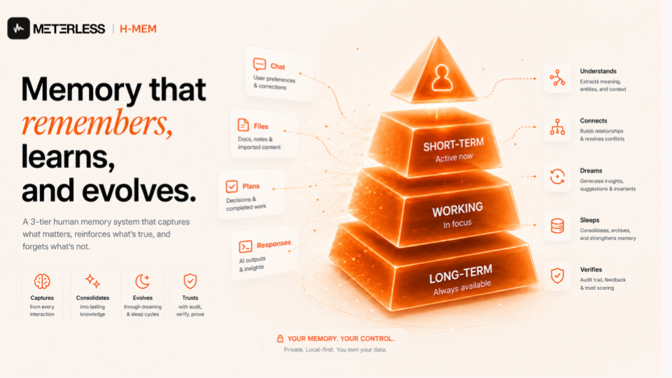
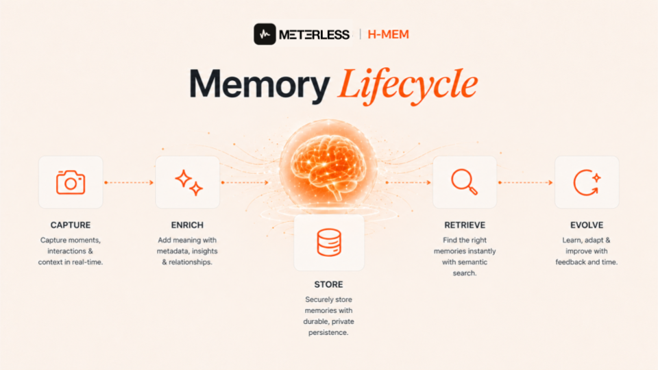
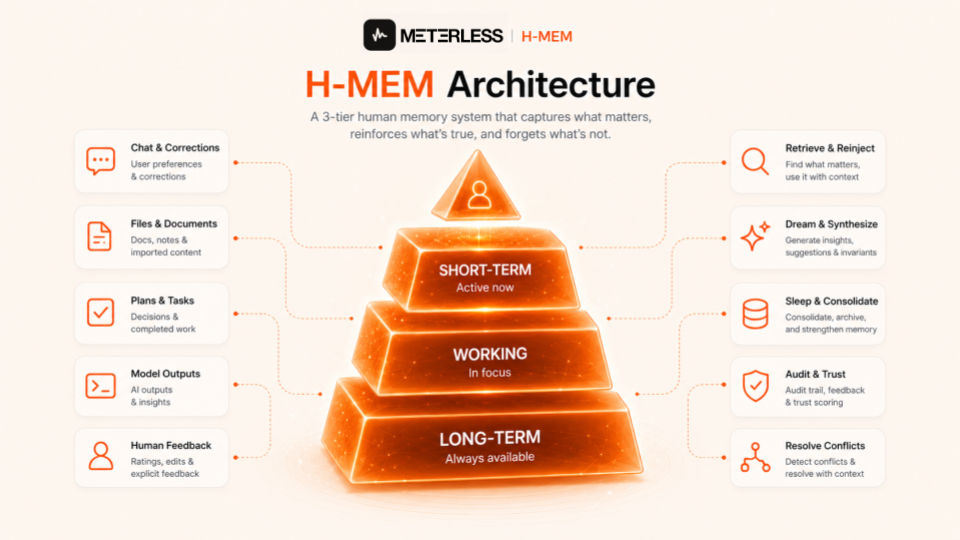
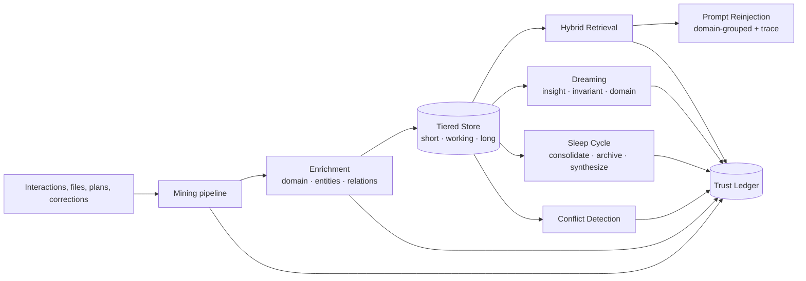
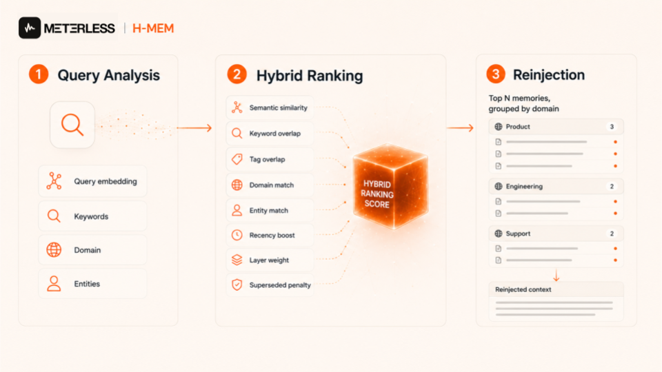
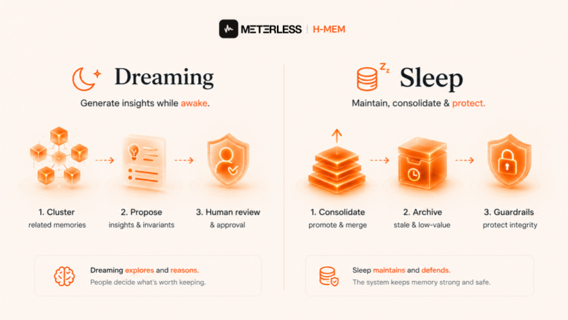

<div align="center">



# Meterless H-MEM

**A living memory system for AI agents. Not a vector store. Not a chat log. A knowledge graph that mines, retrieves, dreams, and audits.**

[](LICENSE)
[](docs/architecture.md)
[](docs/)

[Architecture](docs/architecture.md) · [Memory Record](docs/memory-record.md) · [Retrieval](docs/retrieval-ranking.md) · [Dreaming](docs/dreaming.md) · [Sleep Cycle](docs/sleep-cycle.md) · [Trust Ledger](docs/trust-ledger.md)

</div>

| You get | You build |
|---|---|
| The full spec ([`AGENTS.md`](AGENTS.md)), 14 deep-dive docs, 18 worked examples, 5 workshops, a runnable reference implementation ([`reference/`](reference/)) | The production engine, in your stack, with your storage and models |


---

## Focused clone

Clone just this engine into a fresh folder and hand it to your coding agent:

```bash
npx degit meterless/meterless/engines/hmem my-hmem
```

Then open the folder in Claude Code or another coding agent and follow this folder's [`AGENTS.md`](AGENTS.md).

---

## What is Meterless H-MEM?

Most "AI memory" today is a vector database with a summarizer bolted on. That works until your agent contradicts itself, forgets a correction, surfaces stale facts, or can't explain why it knew something.

H-MEM is the alternative. It stands for hierarchical memory. Which treats memory as **a living knowledge graph with provenance**:

- Memories are mined from chats, files, plans, corrections, and model outputs.
- Every record carries lineage, confidence, source, entities, and relationship edges.
- Retrieval uses hybrid ranking, not just cosine similarity.
- A dreaming cycle proposes new knowledge from clusters of existing memories.
- A sleep cycle consolidates, archives, and synthesizes.
- A trust ledger audits every mutation.
- Conflicts are detected and resolved on a schedule.

Replay and session rewind are deliberately out of scope. This is memory architecture, not playback.

---

## Why use this over any other memory frameworks?



Memory frameworks are everywhere now. Most of them are a vector store with a system prompt taped to the front. You retrieve some chunks, paste them in, call it memory. It works until the model contradicts itself in the same conversation. It works until a correction from yesterday gets buried under five new chunks today. It works until you ask why the agent believes something and there's nothing to point at.

H-MEM is built for what comes after that.

You get tiered storage so the agent actually has a difference between right now, this week, and forever. Hybrid retrieval that ranks by semantic similarity, domain, entities, recency, and trust, not just by cosine distance. An audit ledger so every memory has provenance, every change has an author, and every contradiction gets surfaced instead of silently overwritten. Dreaming and sleep cycles that consolidate, synthesize, and prune, because real memory isn't just storage. It's metabolism.

What that gets you is an agent that doesn't just remember. It builds knowledge. It catches its own contradictions. It develops a history with you that survives a hundred sessions, ten model swaps, and a corrupted database. That's the gap "stuff it in a vector DB" never closes. It's the difference between an agent that performs memory and an agent that actually has one.

---

## Quickstart

This repo is the implementation spec, not a runtime library. You can download the `AGENTS.md` alone. Or clone the repo, open it in your coding agent, and let `AGENTS.md` guide the build into your stack.

```bash
npx degit meterless/meterless/engines/hmem my-hmem
cd my-hmem
# Open in Claude Code, Cursor, Codex, or any AGENTS.md-aware agent
```

Then prompt your agent: *"Implement the H-MEM engine in this project following AGENTS.md."*

### Run something right now

A minimal deterministic reference implementation ships in [`reference/`](reference/). It is not a production library; it is the spec made executable.

```bash
cd reference && npm install && npm test
npx tsx ../examples/01-add-memory/index.ts
```

Every example in [`examples/`](examples/) runs against it with `npx tsx index.ts` (run from `reference/` or after installing tsx). Three cross-engine examples wait on sibling engine references and say so in their READMEs.

The agent will set up your tiered storage (short-term, working, long-term), scaffold the mining pipeline, wire up hybrid retrieval and reinjection, stand up the trust ledger, and leave dreaming and sleep cycles as opt-in stages you can grow into. Architectural reference in `/docs`.

---

## Architecture at a glance





Each block is a service. Run them in one process or split them across workers. The contract between them is the canonical memory record.

---

## The canonical memory record

Every memory carries enough metadata to be ranked, audited, and explained.

| Field | Purpose |
|---|---|
| `id`, `content`, `type` | Identity and content (`personal`, `factual`, `preference`, `general`) |
| `layer` | Storage tier (`short_term`, `working`, `long_term`) |
| `timestamp`, `lastAccessed`, `accessCount` | Recency and usage signal |
| `tags`, `domain`, `namespace` | Hierarchical organization |
| `embedding`, `score` | Retrieval ranking |
| `confidence`, `source` | Reliability tracking — both mandatory; a record without `source` is rejected |
| `provenance` | Origin, when-learned, and human-readable "how I learned this" (mandatory for new writes) |
| `chatId`, `missionId`, `goalRunId` | Recall scoping — chat-scoped and goal-run-isolated retrieval |
| `entities[]`, `relatedTo[]` | Graph edges |
| `supersedes`, `supersededBy`, `derivedFrom[]` | Replacement and synthesis lineage |

Nothing in the system mutates a memory without writing to the ledger.

---

## How retrieval actually works



When the agent needs context, H-MEM does not just nearest-neighbor on an embedding.

The hybrid ranker scores every candidate on:

- Semantic similarity
- Keyword overlap
- Tag overlap
- Domain match
- Entity match
- Layer weight (long-term 1.0 beats working 0.8 beats short-term 0.6)
- Recency boost
- Superseded penalty

The blended score is clamped to [0, 1] and multiplied by the record's `confidence`, so feedback directly moves future ranking (exact weights in [`docs/retrieval-ranking.md`](docs/retrieval-ranking.md)). Top N memories are filtered by threshold and grouped by domain before being injected into the prompt. Each block carries trace metadata: `retrievalReason`, per-memory relevance score, and a strategy label (`minimal`, `personal`, `comprehensive`).

The agent does not just remember. It can explain why.

---

## Dreaming is not cleanup



Sleep cleans. Dreaming **builds**.

The dreaming cycle clusters related memories using content similarity, tag overlap, entity overlap, and domain affinity. Then it proposes three things:

- **Insights.** New factual claims synthesized across multiple memories.
- **Invariants.** Stable behavioral rules drawn from preferences and corrections.
- **Domain suggestions.** Reclassifications for memories that ended up in the wrong bucket.

Nothing materializes without human approval. Approved proposals become new long-term memories with `derivedFrom` lineage pointing at every source. Rejections are logged. The system never lies about where a fact came from.

---

## The sleep cycle

A preview-first maintenance loop:

1. **Consolidate.** Aging short-term memories that earned access promote to long-term.
2. **Archive.** Low-access stale records are removed.
3. **Synthesize.** High-similarity groups merge into a single memory with combined tags, entities, and inherited relationships.

Guardrails prevent the system from archiving superseding records, derived memories, or relationship hubs. Every action creates a backup. Restore is one call.

---

## The trust layer

Every action that touches a memory writes to an append-only ledger:

- Create, read, update, delete
- Promote, demote, merge
- Conflict detected, conflict resolved
- Sleep action (consolidate, archive, synthesize)
- User feedback (helpful, not helpful, wrong)

Feedback closes the loop. `helpful` raises confidence and access count. `wrong` drops confidence and tags for review. The ranker reads those signals on the next query.

---

## Conflict detection

When two memories contradict, the system does not pick the louder one.

A scanner finds candidates using opposing-phrase pairs, divergent numeric claims about shared entities, and high-similarity contradictory statements. Confidence is modified by shared entities, domain match, and explicit relations. Resolutions are explicit (`keep A`, `keep B`, `keep both`, `merge`, `delete both`) and always logged.

---

## Usage Tips

H-MEM is a reference architecture. The repository documents every service boundary, every data contract, every default threshold. Implement it in TypeScript, Python, Rust, or whatever stack you ship. The contracts do not change.

Recommended defaults to start with:

| Setting | Value |
|---|---|
| Retrieval top-N | 5 |
| Retrieval threshold | 0.35 |
| Consolidation threshold | 7 days no access |
| Archive threshold | ≥30 days old AND accessCount ≤2 AND unreferenced |
| Sleep synthesis similarity | cosine ≥0.82 |
| Dream cluster minimum | 2 memories |
| Dream relatedness threshold | 0.35 |
| Max dream proposals per type | 8 |
| Conflict auto-resolve gate | decision confidence ≥0.70 |
| Entities per memory | 10 max |
| Related links per memory | 5 max |

Tune these per domain.

---

## Service boundaries

Implement these as separate modules or one binary. The split is the same either way.

- `MemoryStoreService` for tiered persistence and decay
- `MemoryMiningService` for extraction with model-free fallback
- `MemoryRetrievalService` for ranking and context packaging
- `DreamingService` for proposal generation and approval
- `SleepCycleService` for preview, execute, backup, restore
- `TrustLedgerService` for audit ingest and query
- `ConflictDetectionService` for scan, classify, resolve

Replay belongs in its own optional module if you ever need it.

---

## What H-MEM is not

- Not a vector database. It uses one underneath.
- Not a chat history summarizer.
- Not a generic note system.
- Not a replay or time-travel engine.
- Not provider-specific. The architecture is portable across stacks.

---

## Status

This repository is the agnostic architecture and reference contract, with a minimal runnable reference implementation in [`reference/`](reference/). If you want to wire H-MEM into your agent stack, start with [`docs/architecture.md`](docs/architecture.md) and the [implementation checklist](docs/architecture.md#implementation-checklist).

---

## Contributing

Open an [issue](https://github.com/meterless/meterless/issues) with a use case before opening a PR on architecture. For new ranking signals, conflict heuristics, or dream proposal types, include the test corpus you used to validate.

See [`CONTRIBUTING.md`](CONTRIBUTING.md).

---

## Verify your implementation

The spec ships a conformance suite. An implementation is done when it is green:

```bash
HMEM_IMPL=/abs/path/to/your/index.ts npx tsx conformance/runner.ts
```

Details in [`conformance/`](conformance/).

## License

MIT. Use it. Fork it. Ship it.
