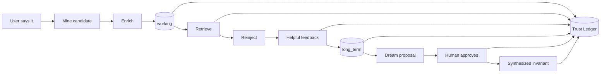

# Demo · Memory Lifecycle (Visual)

A single memory, watched from the moment it is spoken to the moment it becomes validated, synthesized, and audited durable knowledge. Every stage shows the **record state** and the **ledger entry** it produced — because in H-MEM nothing happens off the record.

```text
 capture → enrich → store → retrieve → reinject → feedback
        → promote → dream → approve → sleep → consolidate
```



---

## 1 · Capture

```text
User: Use pnpm for this project, not npm.
```

Mining extracts one durable candidate (not the whole turn):

```text
candidate: "The user prefers pnpm over npm for this project."
```

Ledger: *(nothing yet — not stored until enriched + written)*

## 2 · Enrich

```text
┌─ mem_pnpm_1 ──────────────────────────────────────────┐
│ content     The user prefers pnpm over npm ...        │
│ type        preference                                │
│ layer       working          ← not trusted yet        │
│ domain      tech/frontend    (inferred)               │
│ namespace   project/package-management                │
│ entities    pnpm, npm, project                        │
│ source      session:abc                               │
│ confidence  0.78             ← extracted, below 1.0   │
└───────────────────────────────────────────────────────┘
```

Ledger: `create mem_pnpm_1 · actor=mining:session:abc`

## 3 · Retrieve

```text
Query: "Install dependencies and update the build script."

ranker signals:  entity(pnpm) ✓  domain(tech/frontend) ✓  keyword(install) ✓  recency ✓
score: 0.58  → selected   (clamp01(raw) × confidence 0.78 caps it below 0.78)
```

Ledger: `read mem_pnpm_1 · trace_1 · score=0.58`

## 4 · Reinject

```text
[tech/frontend] (working) The user prefers pnpm over npm for this project. {entities: pnpm, npm}
                  ▲
                  └─ layer marker tells the model this is active-but-not-yet-validated
```

## 5 · Feedback → Promotion

```text
user marks the result helpful (+0.05 per helpful signal)
   confidence  0.78 → 0.83 → (next week, helpful again) → 0.88
   accessCount 1 → 2 → 3
   criteria met → PROMOTE

┌─ mem_pnpm_1 ──────────────┐
│ layer  working → long_term │   ← now validated durable knowledge
└────────────────────────────┘
```

Ledger: `feedback helpful` · `promote working→long_term`

## 6 · Dream

Other pnpm-related memories accumulated. Dreaming clusters them and proposes a *general rule* no single memory states:

```text
dream_prop_pnpm  (invariant)  conf 0.79
  "For this project, package-manager instructions default to pnpm."
  derivedFrom: [mem_pnpm_1, mem_pnpm_2, mem_pnpm_3]
  status: pending_review        ← NOT yet a memory
```

## 7 · Approve

```text
human reviews lineage (3 sources, coherent) → APPROVE

┌─ mem_pnpm_invariant ───────────────────────────┐
│ type        preference                          │
│ layer       long_term                           │
│ derivedFrom mem_pnpm_1, mem_pnpm_2, mem_pnpm_3  │
└─────────────────────────────────────────────────┘
```

Ledger: `dream_approved` · `create mem_pnpm_invariant`

## 8 · Sleep & Consolidate

```text
sleep preview:
  toSynthesize: [mem_pnpm_1, mem_pnpm_2, mem_pnpm_3]  (near-duplicates)
  guardrail:    mem_pnpm_invariant is derived → PROTECTED, never archived

execute:
  backup_sleep_007 created
  3 duplicates → mem_pnpm_canonical (derivedFrom set)
  sources tombstoned
```

Ledger: `sleep_synthesize · backup=backup_sleep_007`

---

## The whole story, as one ledger query

`ledger.history` filtered to this memory family answers, in order:

1. Where did the pnpm rule come from? → mined from `session:abc`.
2. Why was it used? → retrieved at 0.58 under `trace_1`.
3. Why is it trusted now? → helpful feedback x2, promoted to long-term.
4. Where did the *general* invariant come from? → dreamed from 3 sources, **human-approved**.
5. What happened to the duplicates? → synthesized under sleep, backup `backup_sleep_007`.

That unbroken chain — capture to consolidation, every link audited — is the entire thesis of H-MEM.

## See also

- Numbered path: [`examples/01`](../../examples/01-add-memory/README.md) … [`08`](../../examples/08-trust-ledger/README.md)
- Integration scenario: [`examples/preference-learning`](../../examples/preference-learning/README.md)
- Other demos: [`preview-first-sleep-cycle`](../preview-first-sleep-cycle/README.md) · [`trust-ledger`](../trust-ledger/README.md)
