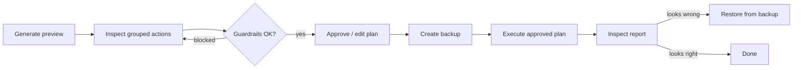

# Demo · Preview-First Sleep Cycle

A guided walkthrough of the operator-safety property that makes sleep trustworthy: **preview → review → backup → execute → (restore if wrong)**. Execution never discovers new work. If it was not in the preview, it does not happen.



---

## Stage 1 · The store has drifted

After weeks of use, four problems exist:

```text
mem_tmp_deadline   short_term  4 accesses, 8 days, helpful        → earned, should promote
mem_old_noise      working     0 access, 45 days, conf 0.30       → dead weight
mem_pnpm_a/b/c     working     three near-identical pnpm prefs    → duplicates
mem_project_hub    long_term   relatedTo 11 memories              → relationship hub
```

## Stage 2 · Preview (nothing changed yet)

```text
sleep.preview()
```

| Action | Memory | Reason | conf/access/age | Guardrail |
| --- | --- | --- | --- | --- |
| consolidate | `mem_tmp_deadline` | earned its keep | 0.8 / 4 / 8d | ✅ pass |
| archive | `mem_old_noise` | stale, unused | 0.3 / 0 / 45d | ✅ pass |
| synthesize | `mem_pnpm_a/b/c` | duplicate group | high sim | ⚠️ needs approval |
| skip archive | `mem_project_hub` | relationship hub | 11 links | ⛔ **blocked** |

The preview carries: memory id, content preview, proposed action, reason, confidence/access/age, guardrail status, affected relationships, and the expected ledger action — everything the operator needs to judge without running anything.

## Stage 3 · Operator review

```text
✔ consolidate mem_tmp_deadline   → auto-approved (confidence + access thresholds met)
✔ archive     mem_old_noise      → approved
⚠ synthesize  mem_pnpm_a/b/c     → operator inspects: yes, all three mean the same thing → approved
⛔ mem_project_hub                → blocked by guardrail, operator cannot override casually
```

Policy: for personal or high-impact memory, **synthesis and archival require explicit approval**; consolidation may auto-approve when thresholds are met.

## Stage 4 · Backup, then execute

```text
sleep.execute(approvedPlan)

backup created:  backup_sleep_001     ← ALWAYS, before any mutation
consolidated:    1   (mem_tmp_deadline → long_term)
archived:        1   (mem_old_noise removed; ledger entry written FIRST)
synthesized:     1   (pnpm group → mem_pnpm_canonical, derivedFrom set)
blocked:         1   (mem_project_hub untouched)
ledger entries:  4
```

## Stage 5 · Restore drill

The report shows `mem_pnpm_canonical` but retrieval for pnpm got *worse*. Investigate, then recover:

```text
sleep.restore("backup_sleep_001")

restored to pre-sleep snapshot
ledger: restore backup_sleep_001 · actor=operator
```

Restore reverses consolidation, archival, and synthesis — **and writes its own ledger entry**. The original sleep report and all prior ledger history remain intact. The bad run stays auditable; the data comes back.

---

## What this demo proves

- **Preview is a contract.** Execute applies *only* the approved preview. No surprises at execution time.
- **Guardrails are not advisory.** `mem_project_hub` cannot be archived just because it is old — losing a relationship hub silently corrupts the graph.
- **Backup + restore is the recovery story.** Destructive maintenance is safe only because every run is snapshotted and every action — including the undo — is on the record.

## See also

- Reference: [`docs/preview-first-sleep-cycle.md`](../../docs/preview-first-sleep-cycle.md) · [`docs/sleep-cycle.md`](../../docs/sleep-cycle.md)
- Examples: [`06-sleep-preview`](../../examples/06-sleep-preview/README.md) · [`sleep-consolidation`](../../examples/sleep-consolidation/README.md)
