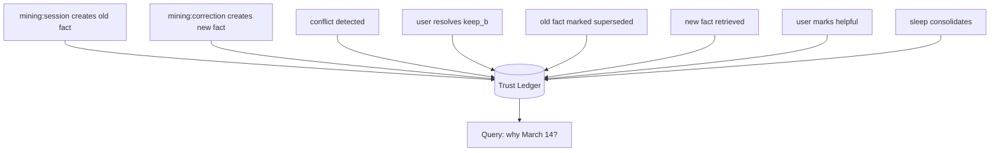

# Demo · Trust Ledger

The trust ledger turns "the agent said March 14" from an unanswerable mystery into a five-line forensic trace. This demo follows one stale fact, its correction, and the full audit chain that lets anyone reconstruct exactly why the agent believes what it believes.



---

## The story

A deadline was captured wrong on Monday, corrected on Tuesday, used on Tuesday afternoon, and tidied up that night.

## The append-only timeline

```text
TIME   ACTION              MEMORY            ACTOR              DETAIL
────── ─────────────────── ───────────────── ────────────────── ─────────────────────────
10:00  create              mem_deadline_old  mining:session     "deadline is March 4"
10:05  create              mem_deadline_new  mining:correction  "deadline is March 14"
10:05  conflict_detected   old / new         scanner            same entity, divergent date
10:06  conflict_resolved   conflict_42       user:42            strategy=keep_b
10:07  update              mem_deadline_old  resolver            supersededBy=new
10:30  read                mem_deadline_new  retrieval           trace_1, score 0.63
10:31  feedback            mem_deadline_new  user:42            signal=helpful, conf ↑
23:00  sleep_consolidate   mem_deadline_new  sleep              backup_1, working→long_term
```

Every line is immutable. Nothing above is ever edited or deleted — corrections are *new* entries, never rewrites.

## The audit question

> **"Why did the agent say the deadline is March 14?"**

`ledger.history({ memoryId: "mem_deadline_new" })` answers it completely:

1. The fact came from a **`user_correction`** at 10:05 (not a guess, not training data).
2. It was in **conflict** with the older March 4 memory — detected at 10:05.
3. A human (**`user:42`**) resolved it `keep_b` at 10:06; March 4 was marked superseded.
4. It was **retrieved** at 10:30 (`trace_1`, score 0.63) when the agent answered.
5. The user marked that answer **helpful** at 10:31, raising its confidence.
6. Sleep **consolidated** it to long-term at 23:00, backup `backup_1`.

No step is hidden. No step is unattributed.

## Other questions the same ledger answers

| Question | Query |
| --- | --- |
| What changed in the last hour? | `ledger.range({ since: now-1h, actions: ["update","delete","synthesize"] })` |
| How many `wrong` feedbacks this week? | `ledger.stats({ since: now-7d, groupBy: "action" })` |
| Did the agent ever use the stale March 4 value after the correction? | `ledger.history("mem_deadline_old")` — shows it superseded at 10:07, no later `read` |
| Who approved consolidating this? | the `sleep_consolidate` entry's actor + backup id |

## Invariants this demo relies on

- **Append-only.** Entries are never mutated; the supersession is a new `update` entry, not a rewrite of the old fact.
- **Delete-before-remove.** A `delete` is ledgered *before* the memory is removed or tombstoned, so even deletions are explainable.
- **Restore preserves history.** Rolling back sleep writes a new `restore` entry; it never erases the timeline above.
- **Never destructively prune.** The full audit log is kept indefinitely. A constrained client that must cap storage exports the oldest segment to an archive artifact and records a `ledger_rotated` entry before trimming — silent pruning would re-introduce the black-box problem H-MEM exists to kill.

---

## What this demo proves

This is the entire reason H-MEM is "not a vector store with a summarizer attached." A vector store can tell you *what* it returned. Only an audited memory architecture can tell you *why it believed it, who changed it, and when* — which is the difference between a demo and something you can ship to real users.

## See also

- Reference: [`docs/trust-ledger.md`](../../docs/trust-ledger.md)
- Examples: [`08-trust-ledger`](../../examples/08-trust-ledger/README.md) · [`07-conflict-resolution`](../../examples/07-conflict-resolution/README.md)
