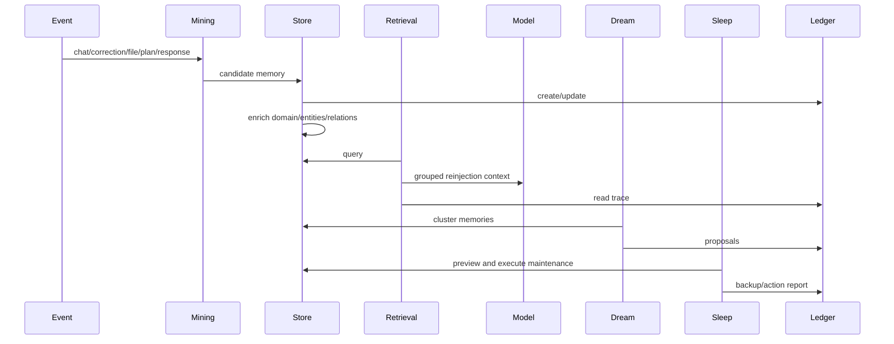

# H-MEM Architecture

H-MEM is a hierarchical human-memory architecture for agents. It combines tiered storage, memory mining, enrichment, retrieval, reinjection, dreaming, sleep, trust, and conflict resolution.

## Design principles

- Treat memory as a living knowledge graph, not a flat note list.
- Separate what is remembered from how it is reinjected into prompts.
- Preserve provenance on inferred memory through `source`, `derivedFrom`, `supersedes`, and `relatedTo`.
- Require human approval for high-impact synthesis.
- Audit every mutation through an append-only trust ledger.
- Degrade gracefully: if extraction models fail, capture direct short summaries rather than dropping information.

## Core services

| Service | Responsibility |
|---|---|
| `MemoryStoreService` | Tiered persistence, CRUD, forgetting curves, promotion, backups |
| `MemoryMiningService` | Mining from the seven event types: chat messages, corrections, file saves/opens/edits, model responses, plan completions |
| `MemoryRetrievalService` | Hybrid ranking, context packaging, trace metadata |
| `DreamingService` | Clustering, proposal generation, approval/rejection handling |
| `SleepCycleService` | Preview, execute, backup, restore, reports |
| `TrustLedgerService` | Append-only audit ingest, query, stats, export |
| `ConflictDetectionService` | Contradiction scans, classification, resolution |

## End-to-end lifecycle

## Data flow

1. Observe interactions or documents.
2. Mine candidate memories using event-specific extraction prompts.
3. Fall back to direct short-term capture if extraction fails.
4. Enrich each memory with domain, namespace, entities, and relationships.
5. Store in the appropriate tier.
6. Retrieve by hybrid ranking when context is needed.
7. Reinject selected memory as grouped prompt context.
8. Capture feedback and adjust confidence/access.
9. Run dreaming for higher-order proposals.
10. Run sleep for consolidation and compaction.
11. Detect and resolve contradictions continuously.
12. Audit everything.

## Operational defaults

| Setting | Default |
|---|---|
| Retrieval top-N | 5 |
| Retrieval threshold | 0.35 (final score, after confidence multiplier) |
| Consolidation threshold | 7 days no recent access |
| Archive threshold | ≥30 days old AND accessCount ≤2 AND unreferenced |
| Sleep synthesis similarity | cosine ≥0.82 |
| Dream cluster minimum | 2 |
| Dream relatedness threshold | 0.35 |
| Max dream proposals per type | 8 |
| Conflict auto-resolve gate | decision confidence ≥0.70 |
| Entity cap per memory | 10 |
| Related links cap per memory | 5 |

## Non-goals

- Replay/session rewind.
- Product-specific UI assumptions.
- Provider-specific model lock-in.
- Silent auto-approval of synthesized memory.

## Implementation checklist

- Define canonical memory schema with lineage fields.
- Implement tiered persistence and migration-safe hydrate.
- Add acquisition hooks for all key event types.
- Implement enrichment, retrieval, reinjection, trust, conflicts, dreaming, and sleep.
- Add metrics and dashboards for memory health.
