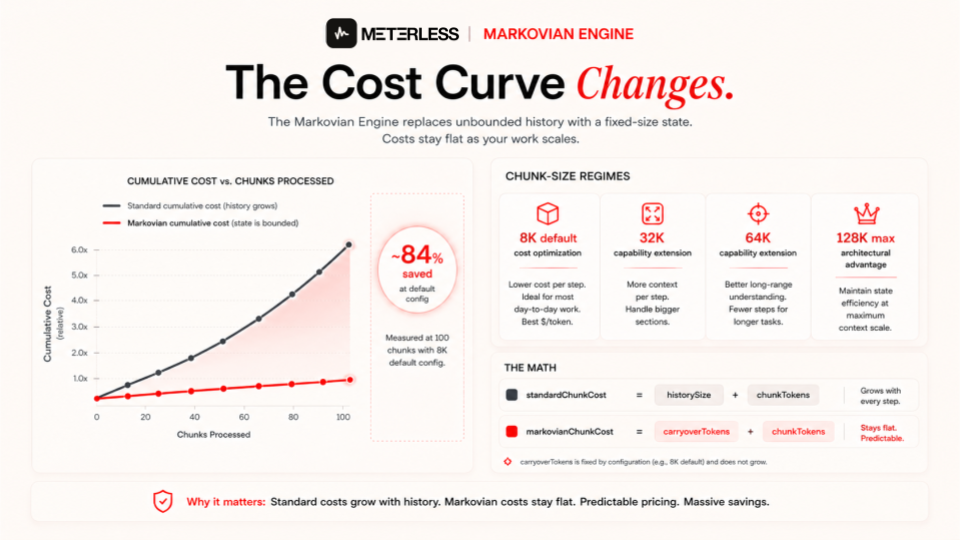
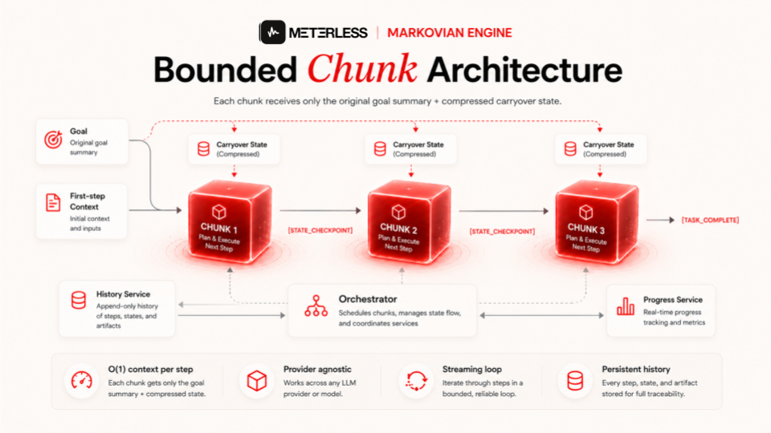
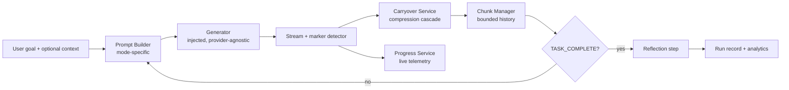
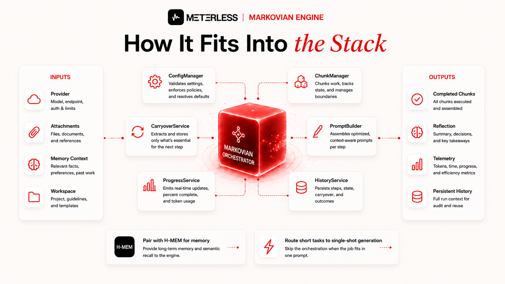
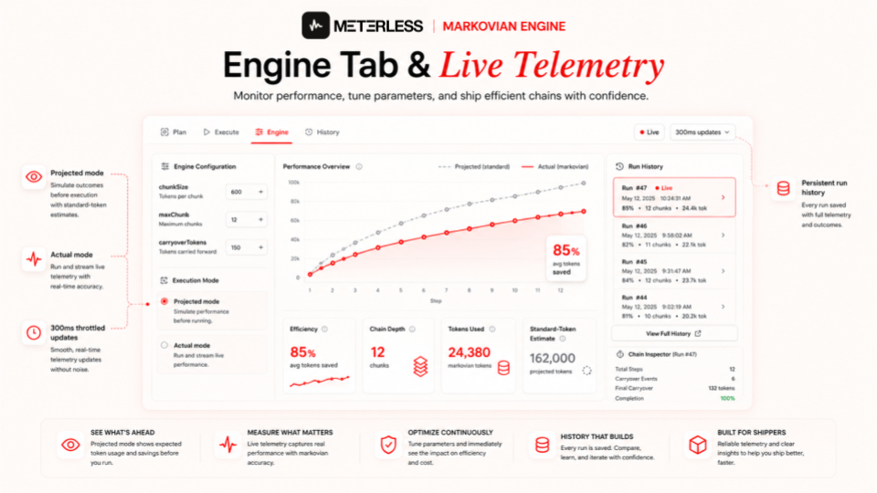

<div align="center">
  

  
# Meterless Markovian Engine

**Long reasoning in bounded chunks. Flat per-step context cost instead of O(n²) cumulative growth. Provider-agnostic implementation spec.**

[](LICENSE)
[](docs/architecture.md)
[](#quickstart)

[Architecture](docs/architecture.md) · [Marker Protocol](docs/marker-protocol.md) · [Engine Tab](docs/engine-tab.md) · [Telemetry](docs/telemetry.md)

</div>

| You get | You build |
|---|---|
| The full spec ([`AGENTS.md`](AGENTS.md)), 11 deep-dive docs, 12 examples, 4 workshops, the token-economics demo, a runnable reference implementation ([`reference/`](reference/)) | The production engine, in your stack, with your provider and storage |


---

## Focused clone

Clone just this engine into a fresh folder and hand it to your coding agent:

```bash
npx degit meterless/meterless/engines/markovian my-markovian
```

Then open the folder in Claude Code or another coding agent and follow this folder's [`AGENTS.md`](AGENTS.md).

---

## The problem

Long reasoning tasks blow up your context window.

A single prompt of "build me the thing" becomes a 30,000-token prompt by step 8. Every step pays the cost of every prior step. Costs grow with the square of chain length. You get truncation, rate limits, latency cliffs, and quality drift.

Markovian fixes this.

---

## What the Meterless Markovian Engine is

A chunked reasoning runtime that runs long tasks as a sequence of bounded steps. Each step sees:

- The original goal (truncated summary after step 1)
- A compressed **carryover state** from the previous step
- Optional first-step context (memory, attachments, workspace)

That's it. Per-step context is effectively constant. Naive full-history prompting is O(n²). Markovian is O(1) per step relative to chain length.

Two modes ship in the reference implementation:

- `ARCHITECT` for build, plan, implement tasks
- `RESEARCH` for recursive analytical work

The runtime is **provider-agnostic**. You inject a generator function. The runtime does the rest.

---

## The math



The reference savings model, applied per chunk `i`:

```
historySize           = (i - 1) * chunkSize
standardChunkCost     = historySize + chunkTokens
markovianChunkCost    = carryoverTokens + chunkTokens
chunkSavings          = max(0, standardChunkCost - markovianChunkCost)
```

The standard approach is **quadratic in chain length**. The Markovian approach is **flat**. That single difference is the entire thesis.

At the reference defaults — `chunkSize = 8000`, `carryoverTokens = 800`, `maxChunks = 24` — a full 24-chunk run **modeled at full chunks** costs the standard approach a cumulative **~2,400,000 tokens** (`8000 × 24 × 25 / 2`). Markovian pays roughly **24 × (800 + 8000) ≈ 211,000 tokens** to work through **~192K tokens of reasoning** at 10% carryover compression. Same work. **~91% modeled savings.**

> **These numbers are modeled, not measured.** They come from the symbolic cost model in [`docs/efficiency-model.md`](docs/efficiency-model.md). Real accounting should use provider-reported usage (`usage.input_tokens` / `output_tokens`) when available and fall back to a `chars/4` estimate only when it isn't — and every published number should say which one it is. Three different figures appear in these docs (91% here, 86% at N=20 in the worked example, ~73% at the interactive demo defaults); they use different N and constants, and [`docs/efficiency-model.md`](docs/efficiency-model.md) reconciles them. For numbers from an actual engine run on your machine: `cd reference && npx tsx scripts/measured-run.ts`.

Chunk size is the knob — turn it, and the engine moves through three distinct regimes (modeled addressable context at the default `maxChunks = 24`, carryover at the 10–15% sizing rule):

| Chunk size | Carryover (10–15%) | Modeled addressable context | Regime |
|---|---|---|---|
| 8K (default) | 800–1,200 | ~192K | **Cost optimization** |
| 32K | 3,200–4,800 | ~768K | **Capability extension** |
| 64K | 6,400–9,600 | ~1.5M | **Capability extension** |
| 128K (max) | 12,800–19,200 | ~3M | **Architectural advantage** |

Save money or extend your reach:

- **Work that fits a native window** — models can already do it in one or a few calls. Markovian just makes it cheaper.
- **Work past a 200K-class window** — Markovian extends models beyond their native ceiling. Native windows still have better in-window coherence; Markovian wins on reach.
- **Work past any native window** — the architectural advantage zone. Chained bounded steps address reasoning surfaces no single call can hold, on any provider, at predictable cost.

Every other approach to long reasoning fights the same quadratic growth — bigger windows, smarter compression, smarter eviction. They buy time; they don't change the curve. Markovian changes the curve: chain depth and chunk size become knobs you turn instead of walls you hit.

Pick the chunk size that matches your workload's total context, latency tolerance, and cost ceiling. The [Engine tab](docs/engine-tab.md) plots both curves live so you can watch the gap open in real time.

---

## Quickstart

This repo is the implementation spec, not a runtime library — `src/` is intentionally empty and there is **no installable npm package**. You can download the `AGENTS.md` alone. Or clone the repo, open it in your coding agent, and let `AGENTS.md` guide the build into your stack.

```bash
npx degit meterless/meterless/engines/markovian my-markovian
cd my-markovian
# Open in Claude Code, Cursor, Codex, or any AGENTS.md-aware agent
```

Then prompt your agent: *"Implement the Markovian engine in this project following AGENTS.md."*

### Run something right now

A minimal deterministic reference implementation ships in [`reference/`](reference/). It is not a production library; it is the spec made executable.

```bash
cd reference && npm install && npm test
npx tsx scripts/measured-run.ts               # naive vs markovian cost, labeled
npx tsx ../examples/run-first-chain/index.ts  # a full chain with a mock LLM
```

Every example in [`examples/`](examples/) runs against it. One cross-engine example (markovian-inside-swarm) waits on the swarm orchestration engine drop and says so in its README.

The agent will pick your chunk config (chunk size, carryover budget, max chunks), wire up the marker protocol, scaffold the compression cascade, stand up run history and telemetry, and leave reflection and resume as opt-in stages you can grow into. Architectural reference in `/docs`.

---

## Architecture





Every component is replaceable. The provider, the compressor, the prompt templates, the persistence layer.

---

## The marker protocol

The model signals continuation vs completion with explicit markers in its output.

| Marker | Meaning |
|---|---|
| `[STATE_CHECKPOINT]` | End of non-final chunk. Followed by concise state summary. |
| `[TASK_COMPLETE]` | Final chunk. Stop recursion. |

Backwards-compatible variants are recognized (`@@@STATE@@@`, `[STATE]`, `---STATE---`, and their final counterparts).

The UI cleans markers before rendering. The runtime uses them to decide whether to loop.

---

## The compression cascade

When extracting carryover state, the engine tries strategies in order, falling through on failure:

1. **Explicit override.** Parse the state block written by the model after the marker.
2. **Model-based compression.** Call the injected compressor with the previous state plus current chunk preview. Enforce a "3-5 critical points" style.
3. **Heuristic extraction.** Regex capture of key phrases (`Therefore`, `Key insight`, `Status`). Compress to semicolon-delimited summary.
4. **Tail truncation.** Last resort. Truncate words to the carryover token budget.

Robust against model instability, API errors, and weird outputs.

---

## Example for use

Wire up a generator function with this conceptual signature:

```ts
type Generator = (
  prompt: string,
  attachments: Attachment[],
  systemPrompt?: string,
  onStream?: (delta: string) => void,
  abortSignal?: AbortSignal,
  extras?: unknown
) => Promise<{ text: string; metadata?: { usage?: { in: number; out: number } } }>;
```

Inject it. Configure `chunkSize`, `maxChunks`, `carryoverTokens`. Run the orchestrator. The runtime handles streaming, compression, completion, reflection, persistence, and telemetry.

Default config:

| Setting | Default | Min | Max | Step |
|---|---|---|---|---|
| `chunkSize` | 8000 | 1000 | 128000 | 1000 |
| `maxChunks` | 24 | 1 | 32 | 1 |
| `carryoverTokens` | 800 | 128 | 32768 | 128 |
| `overlapTokens` | 0 | 0 | 4096 | — |

Configs are validated at load time (typed error, not silent truncation): `chunkSize ≥ framingTokens (≈400) + carryoverTokens + outputBudget (≈1200)`, `carryoverTokens > 0`, and the total must fit the model's context window.

---

## What you get for free

- **Streaming UX.** Completed chunks render as markdown. Active chunk streams as plain text. Markers stripped at render time.
- **Live telemetry.** Real-time efficiency %, chain depth, tokens used, comparable standard-token estimate. Throttled at 300ms to avoid render thrash.
- **Engine tab.** Projected vs actual performance curves, config controls, chain inspector, historical run management.
- **Persistent history.** Every run recorded. Cumulative stats. Per-step aggregates. Backed by IndexedDB and local storage in the reference, swappable.
- **Reflection step.** After the chain completes, the runtime runs a synthesis pass over original goal, final carryover, full content, and code artifact summary.
- **Abort handling.** Signal checked before every chunk and before compression. Partial output preserved.
- **Memory and attachment policy.** Chunk 0 gets full attachments and memory context. Continuation chunks rely on compressed carryover.

---

## Performance reporting



The Engine tab ships two chart modes.

**Projected mode** uses theoretical curves based on current config. Useful before any runs exist. Plots cumulative cost growth for standard vs Markovian at each step.

**Actual mode** aggregates real historical runs step by step. Per-step averages include sample count. Computes real savings and real savings percent.

Auto-switches to actual mode when one or more historical runs exist.

---

## What this is not

- Not a wrapper around any one provider.
- Not a chain-of-thought prompt template.
- Not a memory system. It accepts external memory context but does not store memories itself. Pair it with [H-MEM](https://github.com/meterless/meterless/tree/main/engines/hmem) if you want both.
- Not magic. Token accounting uses provider-reported usage when available and a `chars / 4` estimate as fallback only — label reported numbers as measured vs estimated.

---

## Known limitations

These are documented honestly in the reference:

- Token estimation falls back to `chars/4` when provider usage is unavailable; it is not tokenizer-precise. Prefer provider-reported usage and label numbers accordingly.
- `overlapTokens` has defined semantics: when non-zero, the final `overlapTokens` of chunk N's cleaned output are prepended to chunk N+1's prompt in an `[OVERLAP]` block, after the carryover. An implementation must either implement this or reject a non-zero value — accepting and ignoring the field is a contract violation.
- Output validation ships as the conclusion/reflection pass (`ratify` / `refine` modes) — see [`docs/reflection.md`](docs/reflection.md).
- Every run record **must** carry its own `chunkConfig` snapshot; historical efficiency is computed against the run's own config, never the current one.

---

## Integration patterns

Markovian sits behind any provider stack. Cloud API, local model, gateway, or hybrid.

Route long-form modes to the orchestrator. Route short-form requests to single-shot generation. Pick your model upstream. The runtime does not care.

---

## Service boundaries

Build it as separate modules or one binary. The contracts are the same:

- `ConfigManager` for live `ChunkConfig` and projected efficiency
- `ChunkManager` for ID allocation, storage, max-chunks enforcement
- `CarryoverService` for the compression cascade
- `PromptBuilder` for mode-specific templates
- `Orchestrator` for the streaming loop
- `ProgressService` for live telemetry
- `HistoryService` for persistent analytics

---

## Contributing

Open an issue with the failure mode before opening a PR on runtime logic. Include a chain reproduction. For new compression strategies, include the corpus you tested against.

See [`CONTRIBUTING.md`](CONTRIBUTING.md).

---

## Verify your implementation

The spec ships a conformance suite. An implementation is done when it is green:

```bash
MARKOVIAN_IMPL=/abs/path/to/your/index.ts npx tsx conformance/runner.ts
```

Details in [`conformance/`](conformance/).

## License

Apache 2.0. Use it. Fork it. Ship it.

---

Part of the [Meterless](https://www.meterless.ai) stack · [github.com/meterless/meterless](https://github.com/meterless/meterless)
