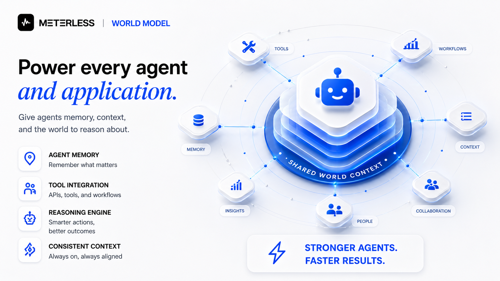
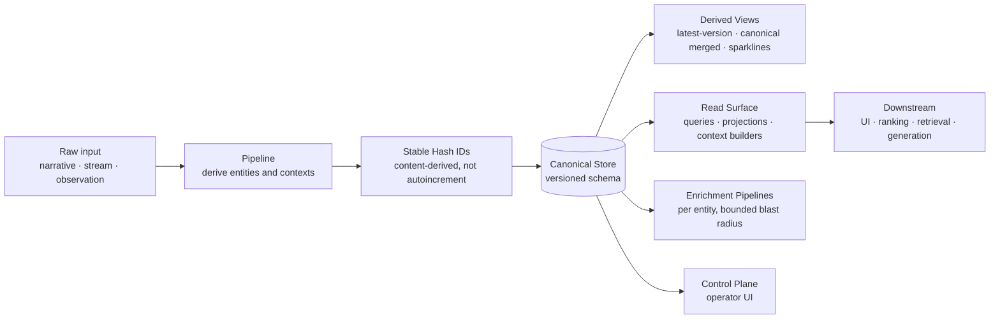
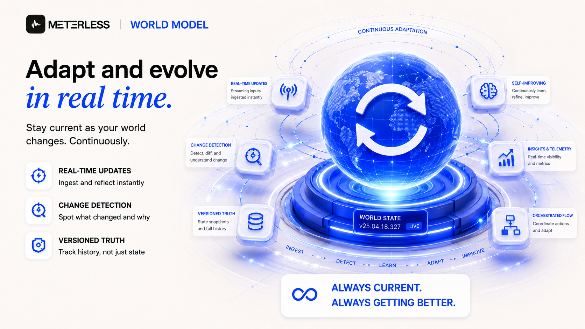
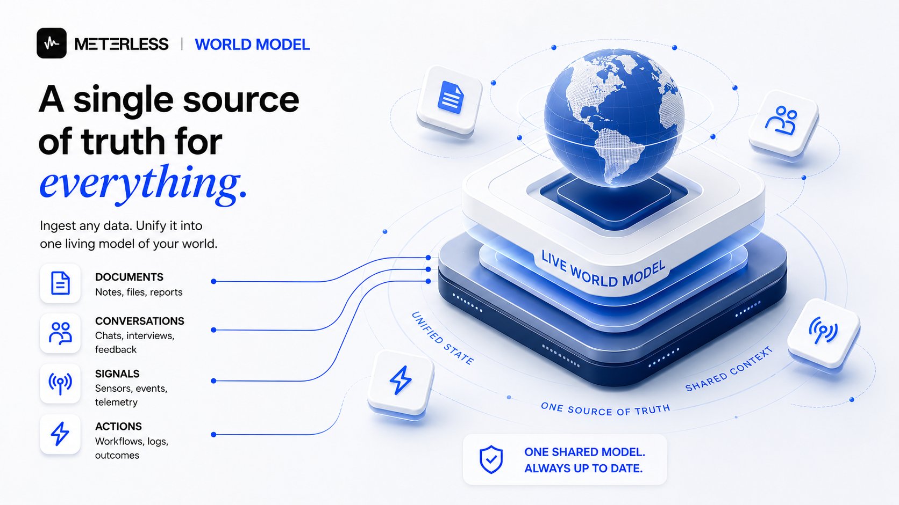

<div align="center">
  

  
# Meterless World Model

**A persistent, queryable, evolving graph of entities, contexts, and relationships. Domain-agnostic. Append-friendly. Idempotent.**

[](LICENSE)
[](docs/architecture.md)
[](#quickstart)

[Architecture](docs/architecture.md) · [Data Model](docs/aggregate-shapes.md) · [Pipeline](docs/ingest-pipeline.md) · [Read Surface](docs/read-surface.md)

</div>

| You get | You build |
|---|---|
| The full spec ([`AGENTS.md`](AGENTS.md)), 9 deep-dive docs, 10 examples, 4 workshops, a live operator control plane, a runnable reference implementation ([`reference/`](reference/)) | The production engine, in your stack, with your storage and models |


---

## Focused clone

Clone just this engine into a fresh folder and hand it to your coding agent:

```bash
npx degit meterless/meterless/engines/world-model my-world-model
```

Then open the folder in Claude Code or another coding agent and follow this folder's [`AGENTS.md`](AGENTS.md).

---

## What is a Meterless World Model

A world model is a **persistent, queryable, evolving representation** of things, the contexts they appear in, and the relationships between them.

This repository documents the architecture in **domain-agnostic** terms. The same architecture runs across very different domains:

| Domain | Entity | Context | Relationship |
|---|---|---|---|
| Narrative tools | Characters, props, locations | Scenes, snapshots | Appears with, conflicts with |
| News aggregators | Articles, publishers, figures | Stories, topics, hashtags | Cited by, contradicts |
| Knowledge bases | Documents, claims, authors | Topics, citations | Supports, refutes |
| Agent platforms | Tasks, tools, observations | Sessions, world state | Depends on, blocks |
| Games and simulations | Actors, items, regions | Events, ticks | Owns, faction-aligned |
| Product analytics | Users, features, sessions | Cohorts, releases | Used by, derived from |
| CRM and sales | Companies, contacts, deals | Quarters, signals | Reports to, won by |
| Scientific bases | Molecules, papers, experiments | Studies, citations | Cites, builds on |
| IoT and monitoring | Devices, streams, incidents | Regions, time windows | Located at, triggered by |
| Compliance and risk | Entities, transactions, alerts | Lists, periods | Sanctioned by, related to |

If your product needs to **remember things, reason about them, and display them**, this architecture applies.

---

## Why use a World Model?



A canonical store for the entities, contexts, and relationships your agents need to share. Idempotent ingest, stable IDs, schema-versioned storage, derived views that can be rebuilt from the log, and an operator surface for inspecting and repairing the model.

That's the mechanics. The reason it matters is bigger.

Most AI systems today are amnesiac. They re-discover the same accounts, the same characters, the same world every conversation. Memory is per-session; understanding is shallow; nothing accumulates. You can scale parameters all you want — without a shared world, the system never becomes situated in anything.

World Model is the substrate for agents that *know where they are*. A persistent, queryable, evolving picture of the world the system operates in — the people in it, the histories they carry, the relationships they hold, the situations they're inside. Once that exists, agents stop guessing and start reasoning from grounded state. Continuity replaces context-stuffing. Identity replaces inference. Behavior gets uncannier — not because the model got smarter, but because for the first time it has somewhere to *stand*.

That's the unlock. The mechanics are how you build it. The world is what you get.

---

## Quickstart

This repo is the implementation spec, not a runtime library. You can download the `AGENTS.md` alone. Or clone the repo, open it in your coding agent, and let `AGENTS.md` guide the build into your stack.

```bash
npx degit meterless/meterless/engines/world-model my-world-model
cd my-world-model
# Open in Claude Code, Cursor, Codex, or any AGENTS.md-aware agent
```

Then prompt your agent: *"Implement the World Model engine in this project following AGENTS.md."*

### Run something right now

A minimal deterministic reference implementation ships in [`reference/`](reference/). It is not a production library; it is the spec made executable.

```bash
cd reference && npm install && npm test
npx tsx scripts/idempotency-check.ts          # the core invariant, proven
npx tsx ../examples/minimal-entity-graph/index.ts
```

Every example in [`examples/`](examples/) runs against it (two cross-engine examples wait on future engine drops and say so). The operator control plane has a live version at [`control-plane/live.html`](control-plane/live.html), running the real implementation in your browser from a double-click.

The agent will pick your aggregate shape (timeline or stream), help you define entity types, scaffold the pipeline, build the read surface, and wire up the control plane. Architectural reference in `/docs`.

---


## Architecture



The store is the source of truth. Every derived view can be rebuilt. Failures in one entity's enrichment do not poison the rest of the world.

---

## Two recurring shapes

Most production world models are one of these or a hybrid.

### Timeline of snapshots

```text
World
  ├─ id, name
  ├─ snapshots: Snapshot[]
  │     ├─ timestamp
  │     ├─ context (config, location, scene)
  │     └─ entities: Entity[]
```

Suits narrative tools, simulations, agent traces, game state. Each snapshot is a complete view. Entities exist **within** the snapshot.

### Stream-clustered facts

```text
World
  ├─ id, name
  ├─ stream: Observation[]
  ├─ aggregates: Aggregate[]   // stories, topics, incidents
  └─ canonical_entities: Entity[]
```

Suits research, news, monitoring, intelligence. A stream of incoming items is clustered into higher-order aggregates. Canonical entities are recomputed from the stream.

Pick the one that matches how your domain accumulates state.

---



## The pipeline

Every observation runs the same six-stage write path:

1. **Extract.** Pull raw records; stamp a content-addressed dedupe key.
2. **Normalize.** Canonical text, language, timestamps, source provenance.
3. **Resolve.** Compute stable IDs, follow aliases. Hash-based, deterministic.
4. **Validate.** Schema check + provenance check. No provenance → rejected.
5. **Append.** New event in the append-only log. The only exactly-once stage.
6. **Project.** Recompute derived views. Latest maps, canonical merged entities, sparklines.

Batch and streaming ingests wrap this per-observation path in a 10-step aggregate cycle (reconcile → cluster → … → rebuild aggregates → mark stale) — see [`AGENTS.md`](AGENTS.md) §4.1 and [`docs/ingest-pipeline.md`](docs/ingest-pipeline.md). Enrichment runs as bounded per-entity jobs alongside; one failure does not block others.

Re-running on the same input produces the same world. **Idempotent by construction.**

---

## The read surface

Consumers do not query the canonical store directly. They go through a read surface that provides:

- **Lookups.** Single-entity, single-context, single-relationship.
- **Projections.** Latest version, merged canonical view, sparkline over time.
- **Context builders.** Pack entities, contexts, and relationships into prompts or UI views with a token or row budget.
- **Provenance.** Every read can trace back to the rows that contributed.

Generation, retrieval, ranking, and the UI all call into the same read surface. There is one source of truth and one access pattern.

---

## Concurrency and consistency

Append-friendly storage tolerates concurrent writes naturally. The model recommends:

- **Single-writer per entity** for enrichment, multiple readers anywhere.
- **Queue enrichment work.** Worker pools per entity type. Backpressure on bursts.
- **Eventual consistency on derived views.** Reads against the canonical store are strongly consistent. Reads against derived views are typically rebuilt within seconds.
- **Schema-versioned storage.** Migrations are explicit and inspectable.

---

## The operator control plane



A world model needs a control plane, not just an API.

Operators inspect entities, contexts, and relationships. They merge duplicates. They split conflated entities. They mark canonical preferences. They trigger re-enrichment.

The control plane writes back into the canonical store **the same way the pipeline does**. There is no privileged path.

That is how the model stays trustworthy.

---

## What you get for free

- **Idempotent ingestion.** Re-run, backfill, repair without duplication.
- **Stable cross-process identity.** Hash IDs let any worker resolve any entity.
- **Bounded blast radius.** One bad entity does not break the world.
- **Schema versioning.** Migrations are inspectable and reversible.
- **Provenance.** Every derived value traces back to the rows that produced it.
- **Portable storage.** The same architecture runs client-side on IndexedDB, server-side on Postgres, or distributed across workers and queues.

---

## What this is not

- Not a graph database. It uses one (or doesn't) underneath.
- Not a vector store. It uses one for enrichment if you want.
- Not domain-specific. Characters and articles and devices use the same shape.
- Not a chat memory. Pair it with [H-MEM](https://github.com/meterless/meterless/tree/main/engines/hmem) if you want both.

---

## Reusable principles

If you only adopt three things from this repo:

1. **Hash-based stable IDs.** Stop using autoincrement for entities.
2. **Append-only canonical store. Recomputed derived views.** No silent mutations.
3. **Bounded blast radius on enrichment.** One worker per entity. Failures isolated.

Those three principles take a system from "works in demo" to "survives production."

---

## Trade-offs and portability

Be honest about the costs:

- **Idempotency requires deterministic enrichment.** LLM calls inside the pipeline must be re-runnable or cached.
- **Derived views can lag.** Reads against them are eventually consistent. Plan for that in your UI.
- **Hash IDs need name normalization.** Get casing, whitespace, and diacritics right, or you create silent duplicates.
- **Append-only stores grow.** Plan retention policies per entity type up front.

See [`docs/trade-offs.md`](docs/trade-offs.md).

---

## Service boundaries

Implement as composable services or one binary. The contracts are the same:

- `IngestPipeline` for normalize, derive, resolve, append
- `EntityResolver` for stable ID generation and dedup
- `EnrichmentWorkers` per entity type, bounded blast radius
- `DerivedViewBuilder` for projections and materialized views
- `ReadSurface` for queries, projections, context builders
- `ControlPlane` for operator actions
- `MigrationService` for schema versioning

---

## Contributing

Open an [issue](https://github.com/meterless/meterless/issues) with the domain and the aggregate shape before opening a PR. For new entity resolution heuristics, include the test corpus you used to validate (especially edge cases on naming and diacritics).

See [`CONTRIBUTING.md`](CONTRIBUTING.md).

---

## Verify your implementation

The spec ships a conformance suite. An implementation is done when it is green:

```bash
WORLD_MODEL_IMPL=/abs/path/to/your/index.ts npx tsx conformance/runner.ts
```

Details in [`conformance/`](conformance/).

## License

MIT. Use it. Fork it. Ship it.
