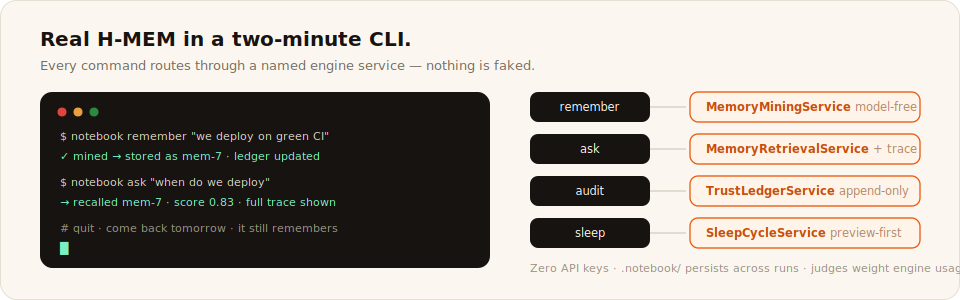

# Agentathon Starter: The Research Notebook Agent

A CLI agent whose memory is real H-MEM: it mines what you tell it, ranks what it recalls, explains where every answer came from, and remembers across runs. Zero API keys. Your hackathon project starts by replacing the CLI with your own surface and keeping the memory spine.



## Two minutes to first recall

```bash
npx degit meterless/meterless/templates/agentathon-starter my-agent
cd my-agent
npm install
npm run setup        # REQUIRED: vendors the H-MEM reference into vendor/ (gitignored)

npx tsx notebook.ts seed
npx tsx notebook.ts ask "what did we decide about storage"
```

Step 4 is not skippable: `vendor/` is gitignored, so a fresh clone has no engine until setup runs. The startup line always names which engine source loaded.

Quit the terminal, come back tomorrow, ask again: it still remembers. That persistence (`.notebook/`, also gitignored) IS the demo.

## Commands

```bash
npx tsx notebook.ts remember "We always deploy on green CI"
npx tsx notebook.ts ask "when do we deploy"
npx tsx notebook.ts audit mem-1        # the memory's append-only ledger history
npx tsx notebook.ts sleep --preview    # consolidation plan, nothing applied
```

## Where the engine is used (judges look here)

The rubric weights "Meterless engine usage" at 25%. Every command routes through a named H-MEM service; nothing is faked:

| Command | Engine service | Spec section |
|---|---|---|
| `remember` | MemoryMiningService (model-free path) + MemoryStoreService | AGENTS.md 4, 3 |
| `ask` | MemoryRetrievalService (hybrid formula, reinjection, trace) | AGENTS.md 6 |
| `audit` | TrustLedgerService (append-only history) | AGENTS.md 9 |
| `sleep` | SleepCycleService (preview-first, guardrails, backup) | AGENTS.md 8 |
| answer quality over time | feedback deltas are one call away: `hmem.feedback(id, "helpful")` | AGENTS.md 9.2 |

## Add a real model (optional)

The default answer mode is retrieval-only and fully offline. With a key:

```bash
npm install @anthropic-ai/sdk
ANTHROPIC_API_KEY=... npx tsx notebook.ts ask "what did we decide about storage"
```

The reinjected memory block goes into the prompt; the answer cites memory ids. Both modes are labeled in the output.

## Extension ideas by track

- **Memory agents**: extend mining with your own event types; wire `feedback` to thumbs up/down; build the dream review UI.
- **Desktop agents**: pair the notebook with Relay-style execution; memories become preconditions for actions.
- **Creative swarms**: when the swarm orchestration engine drops, fan out variants and remember which ones the user kept.
- **Enterprise workflow**: point `remember` at your CRM export; `ask` becomes account context on demand.

Rubric and tracks: [docs/community/hackathon-guide.md](../../docs/community/hackathon-guide.md). Engine spec: [engines/hmem/AGENTS.md](../../engines/hmem/AGENTS.md).
